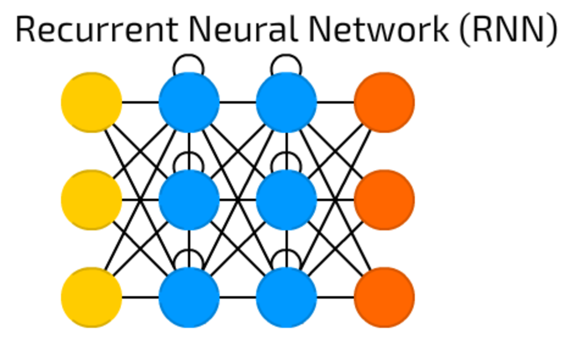

# RNN_from_scratch

This project implements a character-level Recurrent Neural Network (RNN) from scratch using only NumPy.
The RNN is trained on a dataset of names and can generate new, plausible names character-by-character.
It includes data preprocessing, forward and backward passes, parameter updates, and sampling from the trained model.
No deep learning libraries are used to help understand the inner workings of RNNs.